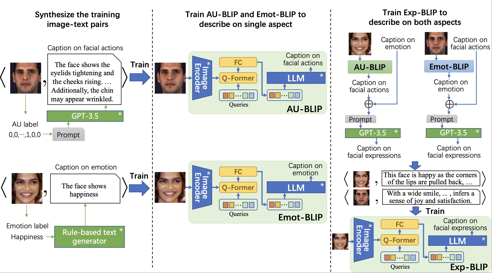

# Official PyTorch Implementation of Exp-BLIP (BMVC 2023 Oral).




> [**Describe Your Facial Expressions by Linking Image Encoders and Large Language Models**]<br>
> [Yujian Yuan](https://vipl.ict.ac.cn/edu/student/master/202210/t20221019_123529.html), [Jiabei Zeng](https://vipl.ict.ac.cn/edu/teacher/mastersupvisor/202205/t20220517_35778.html), [Shiguang Shan](https://scholar.google.com/citations?user=Vkzd7MIAAAAJ&hl=zh-CN)<br>Institute of Computing Technology, Chinese Academy of Sciences;
 University of Chinese Academy of Sciences


## 📰 News

**[2023.10.27]** Sythesized captions used for training are [available](#custom-id). <br>
**[2023.9.12]** Exp-BLIP is decided by **BMVC 2023** as an **Oral** presentation! 🎉 <br>
**[2023.8.25]** Exp-BLIP is accepted by **BMVC 2023** ! 🎉 <br>
**[2023.8.20]** Code and trained models will be released here. Welcome to **watch** this repository for the latest updates.


## ➡️ Datasets
Statistics of training and test data. The captions of each image can be downloaded in [Sythesized captions](#custom-id) part.

### (1) AU datasets
|                        |    BP4D   |  DISFA    |   GFT     |  RAF-AU    | Emotionet |
|:-----------------------|:---------:|:---------:|:---------:|:---------:|:---------:| 
| Train(#image/#sub)   	  | 16627*/28 |14814*/24  |17719*/78  |  3733/-    |19046/-   |
| Test(#image/#sub)      | 45805/13  |14535/3    |4034*/18   |  868/-     |2117/-    |

*:sampled sets
  
### (2) Emotion datasets
|                        |    AffectNet   |  RAF-DB |   FaceME   | 
|:-----------------------|:---------:|:---------:|:---------:| 
| Train(#image/#sub)   	  | 287618/-  |  3162/-   |10052/- |
| Test(#image/#sub)      | 4000/-    |		792/-  | - |


## ⬇️ Captions and Models Download


### <div id="custom-id">(1) Sythesized captions</div>
| Caption type                         |                                                    Link                                                    |
|:------------------------------------|:-------------------------------------------------------------------------------------------------------:| 
| AU captions    					   |     [OneDrive](https://1drv.ms/f/s!Atl7YPj4ORSRjfAdcQ10K01tQ6pRYQ?e=PNNn2i)|
| Emotion captions                    |     [OneDrive](https://1drv.ms/f/s!Atl7YPj4ORSRjfAcWSJoqNttXcHaQg?e=mraNW2)   |
| Facial expression captions*          |     [OneDrive](https://1drv.ms/u/s!Atl7YPj4ORSRjfAvi5PzyOXDMKqHsw?e=6y8lL5)    | 

*:pseudo AU/emotion captions are generated by AU/Emot-BLIP(ViT-G,OPT6.7B).

<a name="text"></a>
### (2) Trained models
| Model                         |                                                    Link                                                    |
|:------------------------------------|:-------------------------------------------------------------------------------------------------------:| 
| AU-BLIP(ViT-G,OPT6.7B)    			|     [OneDrive](https://1drv.ms/u/s!Atl7YPj4ORSRjfAxeMouMlluoe9jcg?e=cM3hhd)|
| Emot-BLIP(ViT-G,OPT6.7B)             |     [OneDrive]    |
| Exp-BLIP(ViT-G,OPT6.7B)              |     [OneDrive](https://1drv.ms/u/s!Atl7YPj4ORSRjfAyMrLW_IEY9fCabw?e=qxEVgb)    | 

## 🔨 Installation

1. (Optional) Creating conda environment

```bash
conda create -n expblip python=3.8.12
conda activate expblip
```

2. Download the packages in expblip_requirements.txt 
```bash
pip install -r expblip_requirements.txt
```

3. Download the library [LAVIS](https://github.com/salesforce/LAVIS). 
```bash
git clone https://github.com/salesforce/LAVIS.git
cd LAVIS
```
Note: Please **Not** use pip to install salesforce-lavis

4. move test.py to the folder LAVIS.

```javascript
# Folder structure
-LAVIS
   --lavis
   --test.py
```

## 🤝 Acknowledgement
This work is supported by National Natural Science Foundation of China (No. 62176248). We also thank ICT computing platform for providing GPUs. We thank salesforce sharing the code of BLIP-2 via [LAVIS](https://github.com/salesforce/LAVIS). Our codes are based on LAVIS.
